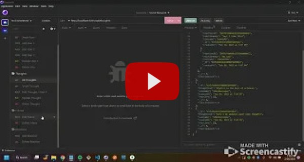

# Social Network API

## Table of Contents

1. [Description](#desc)
2. [Installations](#install)
3. [Usage](#usage)
4. [Demo](#demo)
5. [License](#license)

<a name="desc"></a>
## Description

This is an API for a social network web application where users can share their thoughts, react to friends’ thoughts, and create a friend list. This application uses Express.js for routing, a MongoDB database, and the Mongoose ODM.

<a name="install"></a> 
## Installations

### Install Application

1. Clone this repo.
2. Using your favorite CLI, navigate to the project folder and run `code .` to open Visual Studio.
3. Install this application's dependencies by entering `npm install` into your terminal.
4. Invoke app by entering `npm run dev` into your terminal.

### Install Insomnia HTTP Requests
1. Navigate to the extras directory within this repository, right click on *insomnia_import.json* and save file to your local drive.
2. Open Insomnia and click on the home icon.
3. Select Import From > File, locate the import file on your local drive and click Import.
4. Click on the Social Network collection and proceed to use as normal.

<a name="usage"></a> 
## Usage

* Add new users
```
{
  "username": "lernantino",
  "email": "lernantino@gmail.com"
}
```

* Add new thoughts
```
{
  "thoughtText": "Here's a cool thought ...",
  "username": "lernantino",
  "userId": "(get userid from database)"
}
```

* Add new reaction
```
{
	"reactionId": "507f191e810c19729de860ea",
	"reactionBody": "This is so cool",
	"username": "sheldoncooper"
}
```

* To add a friend, paste other users _id into the HTTP request where prompted.

<a name="demo"></a> 
## Demo

Here's a [video](https://youtu.be/7xvWOQd-83g) of this Social Network API in use.

[](https://youtu.be/7xvWOQd-83g)

<a name="license"></a> 
## License

All code is released under the [GNU General Public License](https://www.gnu.org/licenses/gpl-3.0.en.html).
